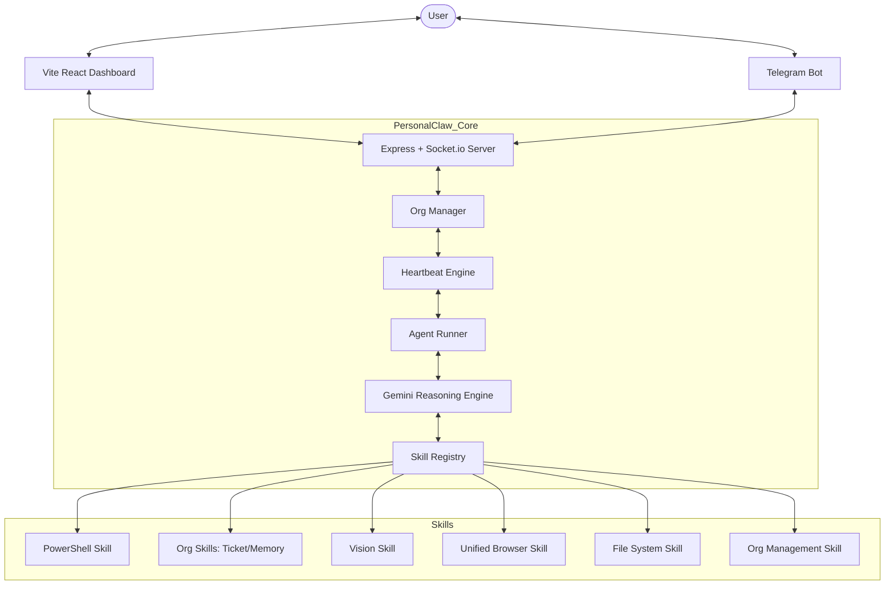

# PersonalClaw - Agent Instructions

Welcome, Agent. You are a PersonalClaw agent operating within the PersonalClaw codebase - a local-first AI automation platform for Windows.

## Project Structure (v12.6)

```
PersonalClaw/
+-- src/                         # TypeScript backend (Express + Socket.io + Gemini AI)
|   +-- index.ts                 # Server entry point — multi-chat + Org wiring + workspace handlers
|   +-- core/                    # Core systems
|   |   +-- brain.ts             # Brain class — Gemini integration, persona injection
|   |   +-- events.ts            # Event Bus — typed events, 45+ constants
|   |   +-- skill-lock.ts        # Skill Lock Manager — concurrent resource protection
|   |   +-- agent-registry.ts    # Agent Registry — worker lifecycle
|   |   +-- conversation-manager.ts  # Conversation Manager — human chat panes
|   |   +-- org-manager.ts       # Org Manager — org/agent CRUD + persistence
|   |   +-- org-heartbeat.ts     # Heartbeat Engine — cron + event triggers
|   |   +-- org-task-board.ts    # Task Board — ticketing system per org
|   |   +-- org-agent-runner.ts  # Agent Runner — executes autonomous agents, injects human comments
|   |   +-- org-file-guard.ts    # Per-org file protection, proposal creation/approval
|   |   +-- org-notification-store.ts # Persistent notifications + Telegram with rate limits
|   |   +-- telegram-brain.ts    # Isolated Telegram Brain instance
|   |   +-- sessions.ts          # Session Manager
|   |   +-- audit.ts             # Audit Logger
|   |   +-- learner.ts           # Self-learning engine
|   |   +-- browser.ts           # Playwright browser core
|   |   +-- chrome-mcp.ts        # Chrome Native MCP adapter
|   |   +-- relay.ts             # Extension Relay bridge
|   +-- skills/                  # Core tool modules
|   |   +-- index.ts             # Skill registry
|   |   +-- org-skills.ts        # Org-specific tools (13 skills: tickets, memory, delegate, proposals, etc.)
|   |   +-- org-management-skill.ts # Human tools for org management
|   |   +-- shell.ts / files.ts / etc. (15 base skills)
|   +-- interfaces/
|   |   +-- telegram.ts          # Telegram bot
|   +-- types/
|       +-- skill.ts             # Skill + SkillMeta interfaces
+-- dashboard/                   # React + Vite frontend (port 5173)
|   +-- src/
|       +-- App.tsx              # Main dashboard + Sidebar + Tabs
|       +-- components/
|       |   +-- ChatWorkspace.tsx        # Human command center
|       |   +-- OrgWorkspace.tsx         # Autonomous org dashboard (8 tabs)
|       |   +-- AgentCard.tsx            # Agent status + EditAgentModal (Reports To dropdown)
|       |   +-- BoardOfDirectors.tsx     # Org command center — expandable agent health cards
|       |   +-- OrgChart.tsx             # Hierarchical org agent visualisation
|       |   +-- ProposalBoard.tsx        # Code change proposals only
|       |   +-- WorkspaceTab.tsx         # Files by agent role, inline editor, comments
|       |   +-- WorkspaceBrowser.tsx     # Directory tree file browser
|       |   +-- OrgProtectionSettings.tsx # Protection config + protected file list viewer
|       |   +-- TicketBoard.tsx          # Kanban task board
|       |   +-- AgentChatPane.tsx        # Direct persistent agent chat
|       |   +-- ConversationPane.tsx     # Legacy/Main chat pane
|       |   +-- WorkerCard.tsx           # Worker status card
|       +-- hooks/
|       |   +-- useConversations.ts   # Human chat state
|       |   +-- useOrgs.ts            # Org & heartbeats state
|       |   +-- useOrgChat.ts         # Persistent agent chat sessions
|       |   +-- useAgents.ts          # Agent registry state
|       +-- types/
|           +-- conversation.ts / org.ts
+-- orgs/                        # Persistent org data (one dir per org)
|   +-- {org-name-shortid}/
|       +-- org.json             # Org config + agents
|       +-- workspace/           # Agent working directory
|       +-- agents/{agentId}/    # Per-agent memory + run logs
|       +-- proposals.json       # Code proposals + review submissions
|       +-- tickets.json         # Task board
|       +-- blockers.json        # Open blockers
|       +-- notifications.jsonl  # Stored notifications
+-- docs/                        # Project documentation
+-- memory/                      # Persistent data (sessions, knowledge)
+-- scripts/                     # Utility scripts
+-- extension/                   # Chrome extension
```

## Technical Architecture (v12.6)



---

## AI Logic (Brain Loop)

PersonalClaw runs a **multi-turn tool execution loop**:
1. Human or Heartbeat triggers an agent.
2. If Heartbeat: OrgAgentRunner creates a Brain with **Persona Injection** (Mission + Role).
3. Brain checks Task Board and Memory, then builds a Plan.
4. **Human comments** on workspace files are injected into the system prompt so agents can act on feedback.
5. Tools execute via `handleToolCall`, acquiring global/per-path locks.
6. Protected file writes are intercepted and routed to the proposal system.
7. Non-code submissions (documents, plans, hiring) are auto-approved unless `requiresApproval: true`.
8. Loop repeats until the agent has achieved its run goals or delegates.
9. Run summary is recorded and session history is saved.

---

## Key Technologies
- Runtime: Node.js with TypeScript (tsx for dev, tsc for build)
- AI Model: Google Gemini (API key in .env)
- Backend: Express + Socket.io for real-time communication
- Frontend: React + Vite dashboard
- Browser Automation: Playwright with persistent context
- Communication: Telegram bot integration

## Rules for Agents
1. Read before writing: Always read existing files before modifying them.
2. Preserve patterns: Follow existing code conventions (ESM imports, .js extensions in imports, async/await).
3. Documentation matters: Update docs/version_log.md when making significant changes.
4. Don't break the server: The backend runs on port 3000, the dashboard on port 5173. Don't change these.
5. Test your changes: Run "npx tsc --noEmit" to verify TypeScript compiles cleanly.
6. Environment variables: All secrets live in .env - never hardcode API keys.

## What You Can Do
- Read and modify any file in this workspace
- Analyze the codebase structure and suggest improvements
- Create issues and track work via GitHub/Local tickets
- Review documentation for accuracy
