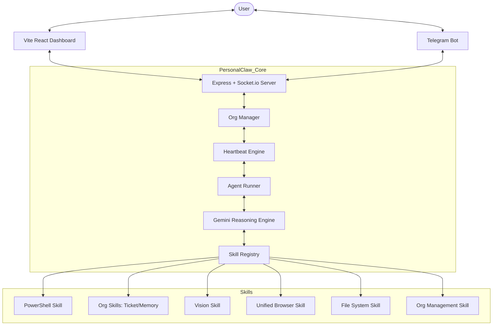

# PersonalClaw Technical Documentation 🦾

PersonalClaw is a modular AI agent designed for autonomous Windows control and automation. It uses Google's **Gemini** model family as its reasoning engine and features a real-time reactive dashboard with multi-chat workspaces, sub-agent workers, and a **v12 Autonomous AI Organisation** system.

**Current Version:** v12.0.0 (March 2026)

---

## 🏗️ Core Architecture (v12)

PersonalClaw uses a multi-layered architecture. The **ConversationManager** manages human chat panes, while the **OrgManager** orchestrates autonomous AI companies. The **OrgHeartbeatEngine** drives agent execution via cron and events, and the **OrgAgentRunner** executes them as persona-injected Brain instances.

### Key v12 Systems
| System | File | Purpose |
|---|---|---|
| Brain (class) | `src/core/brain.ts` | Gemini integration, persona injection, tool loop, meta passing |
| OrgManager | `src/core/org-manager.ts` | Org/Agent CRUD, persistence (`memory/orgs/`), mission state |
| OrgHeartbeatEngine | `src/core/org-heartbeat.ts` | Cron + Event triggered agent execution |
| OrgTaskBoard | `src/core/org-task-board.ts` | Shared Kanban ticket system per org, write-lock protected |
| OrgAgentRunner | `src/core/org-agent-runner.ts` | Runs agents as Brains, manages persistent direct-chat sessions |
| ConversationManager | `src/core/conversation-manager.ts` | Human chat panes with isolated Brains |
| AgentRegistry | `src/core/agent-registry.ts` | Worker lifecycle (human workers + org sub-agents) |
| SkillLockManager | `src/core/skill-lock.ts` | Global concurrent resource protection (v12 extended) |
| EventBus | `src/core/events.ts` | 45+ typed events, decoupled communication |

---

## 📂 Project Structure

### Backend (`/src`)
- `index.ts`: Entry point. Wires up Human Chat + Org Orchestration.
- `core/`: Fundamental systems. v12 adds the `org-*` suite.
- `skills/`: Tool modules. v12 adds `org-skills.ts` and `org-management-skill.ts`.
- `memory/orgs/`: v12 persistent storage for companies, agents, tickets, and runs.

### Frontend (`/dashboard`)
- `components/OrgWorkspace.tsx`: Main UI for managing organisations.
- `components/TicketBoard.tsx`: Kanban-style task management.
- `components/AgentChatPane.tsx`: Dedicated persistent chat windows for org agents.
- `hooks/useOrgs.ts`: Unified state management for orgs, agents, and tickets.

---

## 🛠️ The Skill System

v12 extends the `SkillMeta` with `orgId` and `orgAgentId` to track which company/agent is calling the tool.

### Integrated Skills (17):
1. **PowerShell (`execute_powershell`)**: Full OS control.
2. **Files (`manage_files`)**: File CRUD. Per-path write lock.
3. **Browser (`browser`)**: Unified triple-mode browser. Exclusive `browser_vision` lock.
4. **Vision (`analyze_vision`)**: Gemini Vision analysis. Shares `browser_vision` lock.
5. **Org Management (`manage_org`)**: Human tool to create/update orgs via chat.
6. **Org Skills (`org_create_ticket`, `org_update_ticket`, etc.)**: Agent tools for tickets and memory.
7. **Clipboard (`manage_clipboard`)**: System clipboard. Exclusive `clipboard` lock.
8. **Memory (`manage_long_term_memory`)**: Persists user preferences.
9. **Scheduler (`manage_scheduler`)**: Human-facing cron job management.
10. **HTTP (`http_request`)**: REST API calls.
11. **Network (`network_diagnostics`)**: Diagnostics.
12. **Process Manager (`manage_processes`)**: Monitoring.
13. **System Info (`system_info`)**: Hardware/software diagnostics.
14. **PDF (`manage_pdf`)**: PDF operations. Per-path write lock.
15. **Image Generation (`generate_image`)**: AI image generation.
16. **Agent Spawn (`spawn_agent`)**: Sub-agent worker spawning.
17. **Python (`run_python_script`)**: AI Python execution.

---

## 📡 Messaging Protocols

### Socket.io Events (v11 + v12)
| Event | Direction | Purpose |
|---|---|---|
| `org:list` | Bidirectional | Sync all organisations and agents |
| `org:agent:heartbeat` | Client → Server | Manually trigger an agent run |
| `org:agent:chat` | Client → Server | Send message to a dedicated agent Brain |
| `org:agent:chat:response`| Server → Client | Response from a dedicated agent Brain |
| `org:tickets:list` | Bidirectional | Sync ticket board for an org |
| `org:memory:get` | Client → Server | Get shared/agent memory content |
| `tool_update` | Server → Client | Real-time tool execution progress |
| `metrics` | Server → Client | System telemetry (CPU/RAM/Disk) |

---

## ⚙️ AI Logic (Brain Loop)

PersonalClaw runs a **multi-turn tool execution loop**:
1. Human or Heartbeat triggers an agent.
2. If Heartbeat: OrgAgentRunner creates a Brain with **Persona Injection** (Mission + Role).
3. Brain checks Task Board and Memory, then builds a Plan.
4. Tools execute via `handleToolCall`, acquiring global/per-path locks.
5. Loop repeats until the agent has achieved its run goals or delegates.
6. Run summary is appended to `runs.jsonl` and session history is saved.

---

## 🤖 AI Integration Note
Self-Documenting: The `Brain` utilizes structured tool definitions fetched directly from the skill modules. Any LLM reading this repo can understand its capabilities by inspecting `src/skills/` and `src/core/`.

*“PersonalClaw: Your machine, your command, anywhere.”* 🚀
