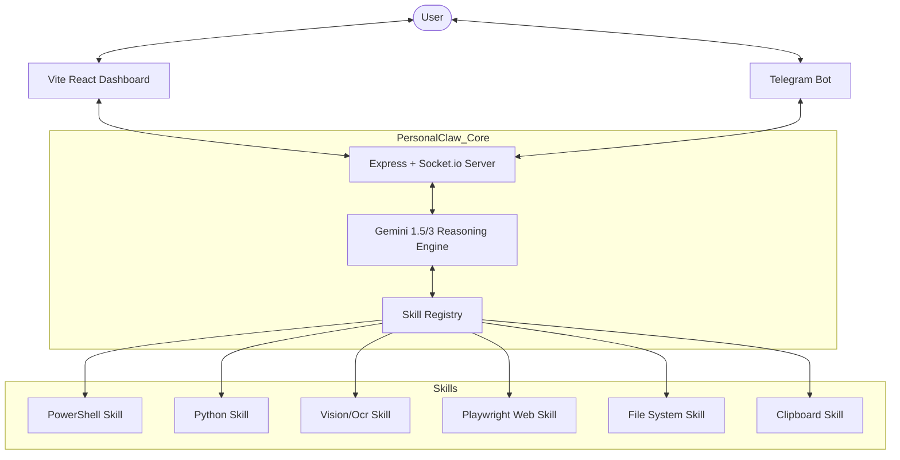

# PersonalClaw Technical Documentation 🦾

PersonalClaw is a lightweight, modular AI agent designed for autonomous Windows control and automation. It uses Google's **Gemini 3 Flash Preview** (v1.1.0) as its reasoning engine and features a real-time reactive dashboard with full Markdown support and dual themes.

---

## 🏗️ Core Architecture

PersonalClaw is built with a hub-and-spoke architecture where the **Brain** (Gemini) acts as the central controller, communicating with various **Skills** (System Tools) and **Interfaces** (User Touchpoints).



---

## 📂 Project Structure

### Backend (`/src`)
- `index.ts`: The main entry point. Sets up the Express server, Socket.io hub, and real-time system metrics (CPU/RAM) broadcasting.
- `core/brain.ts`: Orchestrates the conversation with Gemini. Implements the tool-use loop (Function Calling) allowing the agent to chain multiple actions.
- `skills/`: Standardized modules for system interaction.
- `interfaces/`: Communication providers (e.g., Telegram).
- `types/`: Shared TypeScript definitions.

### Frontend (`/dashboard`)
- `src/App.tsx`: A high-end React UI using `framer-motion` for animations and `lucide-react` for iconography.
- `src/index.css`: Custom "Glassmorphism" design system.

---

## 🛠️ The Skill System

Every skill follows a standardized `Skill` interface to ensure compatibility with Gemini's tool definition format.

### Standard Skill Definition:
```typescript
export interface Skill {
  name: string;
  description: string;
  parameters: object; // JSON Schema
  run: (args: any) => Promise<any>;
}
```

### Integrated Skills:
1. **PowerShell (`execute_powershell`)**: Full OS control. Returns stdout, stderr, and success status.
2. **Python (`run_python_script`)**: Executes arbitrary Python code. High-flexibility data processing.
3. **Files (`manage_files`)**: Handles file CRUD: `read`, `write`, `append`, `delete`, and `list`.
4. **Web Browser (`browse_web`)**: Uses Playwright for `navigate`, `search`, `click`, `type`, and `extract_text`.
5. **Vision (`analyze_vision`)**: Captures high-res screenshots and passes them to the Gemini multimodal API for UI analysis.
6. **Clipboard (`manage_clipboard`)**: Reads and writes to the Windows system clipboard.
7. **Long-Term Memory (`manage_long_term_memory`)**: Persists user preferences and terminology across sessions in `memory/long_term_knowledge.json`.


---

## 📡 Messaging Protocols

### Socket.io Events
- `metrics`: Broadcasts `{ cpu: number, ram: string, totalRam: string }` every 2 seconds.
- `message`: Incoming user text from the dashboard.
- `response`: Outgoing AI responses to the dashboard.

---

## ⚙️ AI Logic (Brain Loop)

PersonalClaw does not just reply to text. It runs a **multi-turn tool execution loop**:
1. User sends message.
2. Brain analyzes intent.
3. If a tool is needed, Brain emits a `functionCall`.
4. Server executes the local skill and sends the output back to the Brain.
5. Step 4 repeats until the Brain has all necessary data to provide a final response.

---

## 🛠️ Developer Setup

### Prerequisites
- Node.js v20+
- Python 3.x
- Gemini API Key

### Installation
```bash
git clone <repo>
npm install
npx playwright install chromium
```

### Environment Variables (.env)
```env
GEMINI_API_KEY=your_key
PORT=3000
TELEGRAM_BOT_TOKEN=optional_token
```

---

## 🤖 AI Integration Note
This codebase is designed to be **Self-Documenting for Models**. The `Brain` utilizes structured tool definitions fetched directly from the skill modules, meaning any LLM reading this repo should be able to instantly understand the available capabilities by inspecting the `src/skills/` directory.
